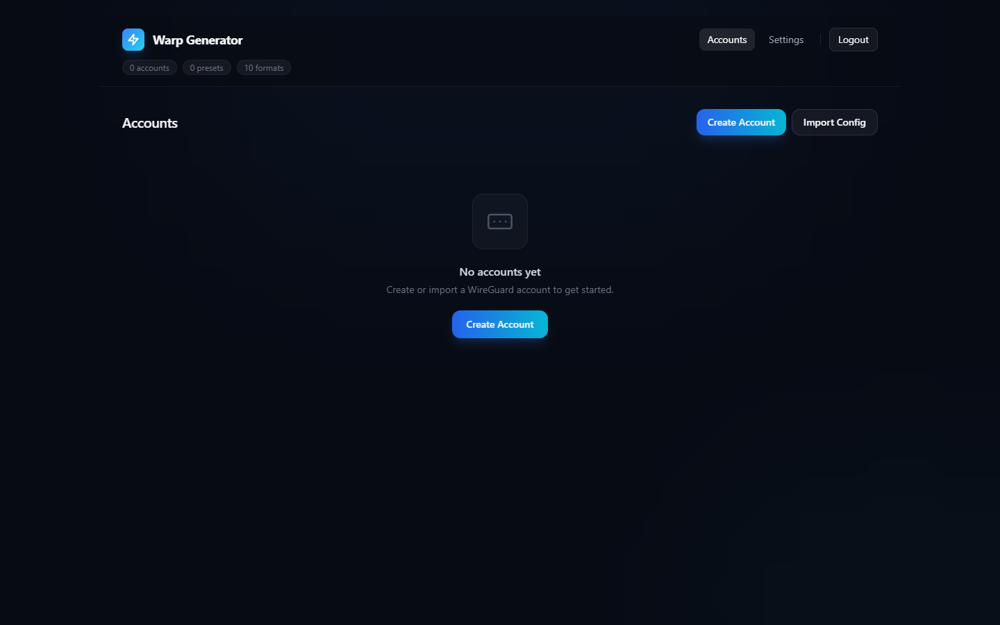
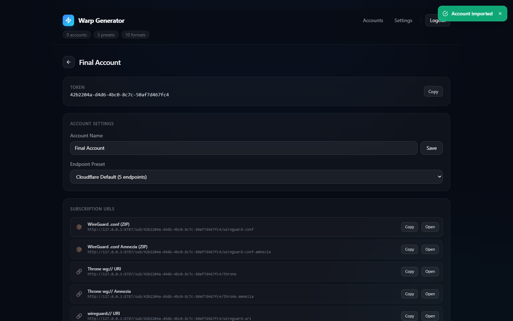
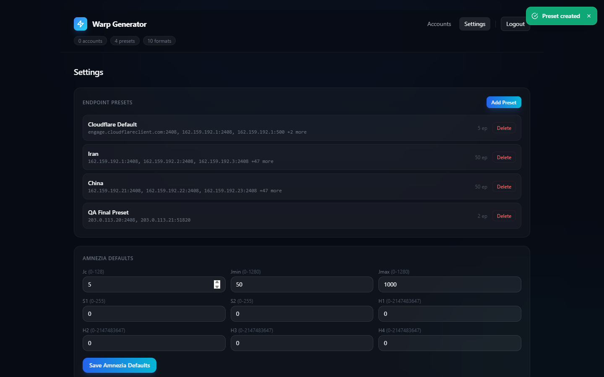
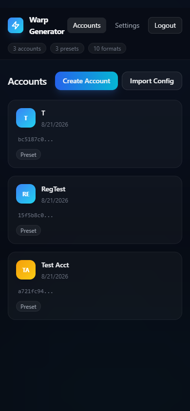

# Warp Generator

[](https://github.com/QMahyar/warp-generator/actions/workflows/ci.yml)   

> **Your private Warp subscriptions, self-hosted on Cloudflare. No VPS. No domain. 5 minutes.**

[](https://deploy.workers.cloudflare.com/?url=https%3A%2F%2Fgithub.com%2FQMahyar%2Fwarp-generator)

**Health:** `GET /healthz` → `{ok, version, kv_ms}` · **Persian / فارسی:** [README.fa.md](README.fa.md)

---

> **v1.0.1 — stable patch.** 17 formats, Cache API + purge, encrypted `.wgenc` backups, group subs, Warp-tolerant client, 257 tests. See [CHANGELOG.md](CHANGELOG.md) · [SPEC.md](SPEC.md) · [DESIGN.md](DESIGN.md)

---

## Why

Cloudflare Warp is fast and free — but has no subscription manager. This Worker fixes that:

- **One file = full backend** — single `_worker.js` (~6700 lines), KV + Cache API, free-tier friendly (100k reads / 1k writes / day)
- **17 formats** — Clash (+Amnezia), Sing-box (+legacy), Xray, Throne (+Amnezia), WireGuard ZIP (+Amnezia), V2RayN, Surge, Loon, Surfboard, Egern
- **Amnezia obfuscation** where DPI censorship needs it — global defaults + per-account Mild/Aggressive
- **Private by design** — keys stay in *your* KV namespace, zero third-party requests (no CDN), admin SPA is fully self-contained
- **v1.0.0 stable:** tolerant Warp client (wrapper/casing/orphan fixes), 257 tests green, Cache API + purge, encrypted `.wgenc` backups, group subscriptions

## Deploy in 5 Minutes

### Option A — 1-Click (no terminal)

1. Click **Deploy to Cloudflare Workers** above
2. Authorize GitHub + Cloudflare → create KV `WARP_KV` when prompted
3. Open `https://<your-worker>.workers.dev/admin/setup` → set password (≥8 chars) → login

### Option B — Wrangler

```bash
git clone https://github.com/QMahyar/warp-generator && cd warp-generator
npm install
wrangler login
wrangler kv:namespace create WARP_KV
# paste id → wrangler.toml: kv_namespaces = [{binding="WARP_KV", id="…"}]
wrangler deploy
# open https://<worker>.workers.dev/admin/setup → set password
```

> **Lock setup takeover:** while no password exists, `/admin/setup` is open to anyone:
> ```bash
> echo $(openssl rand -hex 16) | wrangler secret put ADMIN_SETUP_SECRET
> ```
> The setup form then requires `secret=<value>` until a password is set.

### Local dev

```bash
npm run dev        # wrangler dev --local → http://localhost:8787/admin/setup
npm test           # 257 tests incl. golden byte-contracts
node --check _worker.js
npx wrangler deploy --dry-run --outdir=dist
```

## Use It — 4 Steps

1. **Login** at `/admin` with the password you set
2. **Create account** → `Create Account` (Warp API, retry + compensating delete) or `Import` → drag-drop `.conf` / `wg://` / `wireguard://`
3. **Copy subscription** — any of 17 URLs, **QR** modal (in-browser, no lib), or **deep link** button
4. **Import into VPN client** — Clash Verge (`Profiles → Import`), Throne (`Add Subscription`), sing-box/Hiddify (`Import Remote Profile`) → connects

## Admin UI

Modern dark dashboard (desktop + mobile 390px, glass cards, glow, no external requests):

| | |
|---|---|
|  |  |
|  |  |

- Glass header: stat chips (accounts / presets / 17 formats) + **WARP status chip** (`GET /api/settings/warpstatus` → green/down + `lastError`)
- Account cards: avatar, copyable token, Preset/Amnezia badges, lifecycle chip (`active | expiring | expired | revoked`) + `fetchCount`
- Detail view: all subscription URLs with copy/open/QR/deep-link, rename, preset switch, Amnezia editor, token regenerate, group tag
- Hash router: `#/accounts`, `#/presets`, `#/settings` — URL-addressable, custom confirm modals, toasts, `Esc`/backdrop close, skeletons/empty states
- Preset editor: dynamic endpoint rows, bulk paste (one `ip:port` per line), per-preset DNS, optional `preferredOrder` via browser latency probe
- Per-account Amnezia: Mild/Aggressive one-click presets, inline validation
- Setup checklist banner for first-run onboarding

## Subscription Formats — 17

`{token}` is an account token or an aggregate (`agg`) token. Wrong method → 405, unknown format → 404, expired/revoked → 410.

| Format | Route `/sub/{token}/…` | File | Amnezia | Clients | Deep link |
|---|---|---|---|---|---|
| WireGuard .conf (ZIP) | `wireguard-conf` | `.zip` | no | WireGuard, WireSock | — |
| WireGuard .conf Amnezia | `wireguard-conf-amnezia` | `.zip` | yes | WireSock (+Jc/Jmin/Jmax) | — |
| Throne wg:// | `throne` | `.txt` | no | Throne | `throne://install-subscription?url=` |
| Throne wg:// Amnezia | `throne-amnezia` | `.txt` | yes | Throne | `throne://…` |
| wireguard:// URI | `wireguard-uri` | `.txt` | no | V2RayN | — |
| Sing-box JSON (endpoint) | `singbox` | `.json` | no | Throne, sing-box ≥1.11 | `singbox://import-remote-profile?url=` |
| Sing-box Amnezia | `singbox-amnezia` | `.json` | yes | sing-box-awg | `singbox://…` |
| Sing-box Legacy JSON | `singbox-legacy` | `.json` | no | NekoBox, Hiddify | `hiddify://import/<url>` |
| Sing-box Legacy Amnezia | `singbox-legacy-amnezia` | `.json` | yes | Hiddify | `hiddify://…` |
| Xray JSON | `xray` | `.json` | no | V2RayN, xray | — |
| Clash YAML | `clash` | `.yaml` | no | Clash Verge/Meta | `clash://install-config?url=` |
| Clash Amnezia | `clash-amnezia` | `.yaml` | yes | Clash Meta | `clash://…` (`stash://…`, `loon://…`) |
| V2RayN Base64 | `v2rayn` | `.txt` | no | V2RayN | — |
| Surge INI | `surge` | `.conf` | no | Surge | `surge:///install-config?url=` |
| Loon INI | `loon` | `.conf` | no | Loon | `loon://import?sub=` |
| Surfboard INI | `surfboard` | `.conf` | no | Surfboard | `surfboard:///install-config?url=` |
| Egern YAML | `egern` | `.yaml` | no | Egern | — |

Pattern: `deepLinkUrl(scheme, subUrl) = scheme + encodeURIComponent(origin + "/sub/{token}/{format}")` — see `docs/subscription-formats.md`.

## Client Picker, QR & Deep Links

In account detail view:

1. **Client picker** — pick your app (Clash/Hiddify/NekoBox/Throne/WireSock/WireGuard); starred formats are the recommended ones, rest hidden
2. **QR modal** — in-browser SVG with quiet zone, grows with payload, no CDN — scan from phone → `GET /sub/{token}/{format}`
3. **Deep links** — one tap: `clash://install-config?url=ENCODED_URL`, `singbox://import-remote-profile?url=…`, `hiddify://import/…`, `throne://install-subscription?url=…`, plus `stash://`, `loon://`, `surge:///`

## Backup & Restore — 2 Steps

**The backup file IS your credentials.** It contains every WireGuard private key, protected only by your password (PBKDF2 → AES-GCM). Anyone with file + password owns your tunnels. Store offline, never commit.

1. **Export:** Settings → Backup → password (8–128 chars) → downloads `backup.wgenc` (`WGENC1` magic, vial 2 MiB cap)
2. **Import:** Settings → Restore → pick `.wgenc` + password → `mode: skip | overwrite` → report `{imported, skipped, errors}`

`skip` keeps existing IDs, `overwrite` replaces by `id` (reports `replacedOldTokens`), unknown settings keys become `errors` not KV pollution.

## Ops & Monitoring

- **Health:** `GET /healthz` (no auth) → `{"ok":true,"version":"1.0.2","kv_ms":8}` — point uptime monitor here
- **Warp status chip:** `GET /api/settings/warpstatus` → `{ok, checkedAt, lastError}` — header chip; logs `warp_unexpected_structure` with redacted keys on weird upstream payloads
- **Cache API:** subscriptions cached `origin + /sub/{token}/{format}` (~5 min via `caches.default`); `ctx.waitUntil(put)` best-effort; purged on any account/preset/settings/token/group mutation — `purgeCachedSubscriptions` (per-token) vs `purgeAllCachedSubscriptions` (global edits, now includes `agg:{token}`)
- **KV limits (free):** 100k reads/day, 1k writes/day, 1GB — failures degrade gracefully (`kvGet` → `null`, `kvPut` → `false`, never throw in hot path)
- **Rate limit:** login `auth:fail:{ip}` → 5 fails / 15 min → 429 (KV-backed, eventual consistency — add WAF for stricter)
- **Logs:** structured JSON per request (`route`, `method`, `status`, `ms`) + domain events (`agg_created`, `backup_exported`, `sub_generated`)

## Troubleshooting

| Code | Meaning | Fix |
|---|---|---|
| `404` | Bad token / deleted account / empty group | Re-copy URL from detail (check `agg:{token}` has active members with `group` + `tokenStatus: active`) |
| `410` | `expiresAt` passed or `disabled:true` | Account detail → clear expiry or re-enable; agg tokens have their own `tokenMeta` |
| `405` | Wrong method on known path | Check `Allow` header — v2 returns 405 (was 404 in v1) |
| `429` | Login rate-limited / Warp rate-limited | Wait `Retry-After`; Warp client honors `Retry-After` header with cooldown |
| `500` | Account has no endpoints (preset deleted) | Preset fallback to `DEFAULT_PRESETS`; re-assign preset |
| `502 / 504` | Warp API down / invalid JSON / weird structure | Check chip → `GET /api/settings/warpstatus`; `warp_unexpected_structure` logs keys; retries + orphan delete are automatic |
| KV 500 | `Failed to save` / quota | `wrangler kv:key list --namespace-id=<id> [--prefix account:]`; check free-tier write quota |
| Windows goldens fail | CRLF | Verify `.gitattributes` has `test/golden/*.txt -text` and re-checkout |

**Debug KV:**
```bash
wrangler kv:key get --namespace-id=<id> "settings:password"
wrangler kv:key list --namespace-id=<id> --prefix="account:"
# v1 leftover (harmless): wrangler kv:key list --prefix="cache:" | jq -r '.[].name' | xargs -I {} wrangler kv:key delete --namespace-id=<id> {}
```

## Contributing — For Developers

### Stack & constraints

- **Runtime:** Cloudflare Workers (ES2022, ES Module, `nodejs_compat`); no Node APIs at runtime (fetch, crypto.subtle, streams only; `node:test` dev-only)
- **Storage:** KV (`WARP_KV`) + Cache API (`caches.default`); single file `_worker.js` (~6700 lines), zero build step
- **Deps:** `bcryptjs`, `@noble/curves` (Curve25519), `fflate` (ZIP), `js-yaml` (YAML lineWidth `-1`)
- **Limits:** 10–50ms CPU; no non-function named exports (workerd rejects them — use `testHooks()` at `_worker.js:6950`)

```bash
node --check _worker.js
npm test                          # 257 tests, 16 files, incl. golden byte-contracts
npm run goldens:update            # ONLY after deliberate generator change; review diff!
npx wrangler deploy --dry-run --outdir=dist
npm run dev                       # wrangler dev --local
```

CI (`.github/workflows/ci.yml`): `syntax → npm test → dry-run`; auto-deploys `master` with `CLOUDFLARE_API_TOKEN`.

### Architecture

```
User → /admin/login → Session (bcrypt/pbkdf2 + HttpOnly Secure SameSite=Strict, 24h) → /admin (hash router, no CDN)
           ↓ POST /api/account/generate → Warp client (retry/Retry-After/cooldown + compensating DELETE, redacted logs)
           ↓                            → generateKeypair → KV account:{uuid} + token:{token}
           ↓ GET /sub/{token}/{format} → caches.default.match? hit : resolveToken (account|agg, 410 checks, group merge)
                                      → expandEndpoints (dedupe CIDR/tag/DNS, batch fetch) → FORMATS[format].gen
                                      → +X-WG-Version → ctx.waitUntil(cache.put) → purge on mutation
```

**Core components:**
1. **Route Table** `ROUTES` → `ROUTE_TABLE` (`_worker.js:6790`) — declarative `{method, segments:['api','thing'], auth, handler}`; `dispatchRequest` (`_worker.js:6820`) handles auth, 405+Allow, 501 `/api/*`, 404 else
2. **Format Registry** `FORMATS` (`_worker.js:6430`) — `{contentType, ext, binary, needsAmnezia, gen}`; `handleSubscription` picks `FORMATS[format].gen`
3. **KV via `kvGet`/`kvPut`/`kvDelete`** — never raw `env.WARP_KV` in new code; `null`/`false` → error 500, logged as `kv_error`
4. **Cache API** — `subscriptionCacheRequest` / `cachePutSubscription` / `purgeCachedSubscriptions` / `purgeAllCachedSubscriptions` (now includes `agg:{token}`)
5. **Warp client** (`_worker.js:4101`) — tolerant parsing, case-insensitive `client_id`/`public_key`, orphan delete, `validateWarpAddresses`

### KV schema

| Key | Value |
|---|---|
| `account:{uuid}` | Account (additive: `dns`, `group`, `tokenMeta {label,expiresAt,disabled}`, `fetchCount`) |
| `token:{token}` | `token → uuid` |
| `agg:{token}` | `{token, groups[], label?, created_at, tokenMeta?}` |
| `session:{token}` | Session with expiry |
| `auth:fail:{ip}` | Rate-limit counter |
| `settings:password` | PBKDF2/bcrypt hash |
| `settings:global` | `{amnezia}` |
| `settings:warpstatus` | `{ok, checkedAt, lastError}` |
| `presets` | Preset array (`dns`, `preferredOrder`) |
| `cache:*` | *removed v1.0.0 — abandoned, harmless* |

### Adding a subscription format

1. Research spec (`research/`)
2. Write `generateFoo(configs, amneziaParams)` in `_worker.js`
3. Add `FORMATS['foo']={contentType, ext, binary, needsAmnezia, gen}` (`_worker.js:6430`)
4. Add to dashboard `SUB_FORMATS` so UI exposes it
5. `npm run goldens:update` (review diff!) + test in real client

`/sub/{token}/{format}` needs no route change — registry drives dispatch.

### Adding a route

Add one entry to `ROUTES` (`_worker.js:6790`). Auth, 405, 501/404 come free. Expose via `testHooks().ROUTE_TABLE` if tests need it.

### Testing

- Pure helpers exported directly: `parseWireGuardConf`, `validate*`, `generate*`
- Non-function constants via `testHooks()` (`FORMATS`, `ROUTE_TABLE`, `VERSION`, …) — workerd rejects non-function named exports
- Goldens are byte contracts — any generator change breaks `goldens.test.mjs`; regenerate deliberately

Manual spot-checks still required: real Warp registration, client imports, QR scans, deep links.

## API Reference

All `/api/*` require session cookie (except `/healthz`, `/sub/*`). Wrong method → `405` + `Allow`.

| Area | Method | Endpoint | Description |
|---|---|---|---|
| Health | `GET` | `/healthz` | `{ok, version, kv_ms}` |
| Account | `GET` | `/api/account` | List |
| | `GET` | `/api/account/{id}` | Get |
| | `POST` | `/api/account/generate` | Generate `{name}` → Warp API |
| | `POST` | `/api/account/import` | Import `{name, config}` |
| | `PUT` | `/api/account/{id}` | Update `{name?,endpoint_list?,amnezia_overrides?,dns?,group?,tokenMeta?}` |
| | `DELETE` | `/api/account/{id}` | Delete |
| | `POST` | `/api/account/{id}/regenerate-token` | New token |
| Token | | `tokenMeta {label,expiresAt,disabled}` → 410 when expired/revoked, `fetchCount` auto | |
| Preset | `GET/POST` | `/api/presets`, `/api/presets/{id}` | CRUD (`dns`, `preferredOrder`) |
| Settings | `GET/PUT` | `/api/settings/amnezia`, `/api/settings/warpstatus` | Amnezia + WARP chip |
| Backup | `POST` | `/api/backup/export` | `{password}` → `.wgenc` (AES-GCM); capped 2 MiB |
| | `POST` | `/api/backup/import` | `{blob, password, mode=skip\|overwrite}` |
| Agg | `GET/POST/DELETE` | `/api/agg`, `/api/agg/{token}` | Group subscriptions |
| Sub | `GET` | `/sub/{token}/{format}` | 17 formats, Cache API, `X-WG-Version` |

## Input Validation (SPEC AC11 + addendum)

| Field | Rule |
|---|---|
| Name | 1–100 chars, no `\x00-\x1f\x7f<>` |
| Config | 100B–10KB |
| Private key | Base64 32B, no whitespace |
| IP | Strict IPv4/IPv6/domain (253 chars, label rules) |
| Port | 1–65535 |
| DNS | Valid IP/domain |
| Endpoints/p | 1–200 |
| Password | 8–128 chars (72B bcrypt cap) |
| Amnezia Jc/Jmin/Jmax/S1/S2/H1-H4 | Jc 0–128, Jmin/Jmax 0–1280 Jmin≤Jmax, S 0–255, H 0–2147483647 or `lo-hi` non-overlapping |
| Token label | 1–100 chars |
| expiresAt | Future ISO date |
| Group | Sanitized 1–50 |

400 on bad input with specific message.

## Known Limitations

- Warp API is unofficial — may change; client logs `warp_unexpected_structure` and unwraps wrappers
- Free tier KV eventually consistent (<1s), no transactions (last write wins), list 1000/page
- No multi-admin, no email recovery (`wrangler kv:key delete settings:password` → `/admin/setup`)
- Tokens are public URLs — mitigate with label/expiry/revoke/regenerate
- Latency probe is browser HTTPS RTT, not UDP throughput — advisory only

## License

MIT — see [LICENSE](LICENSE). Spec: [SPEC.md](SPEC.md) · Design: [DESIGN.md](DESIGN.md) · Changelog: [CHANGELOG.md] · Persian: [README.fa.md](README.fa.md)
