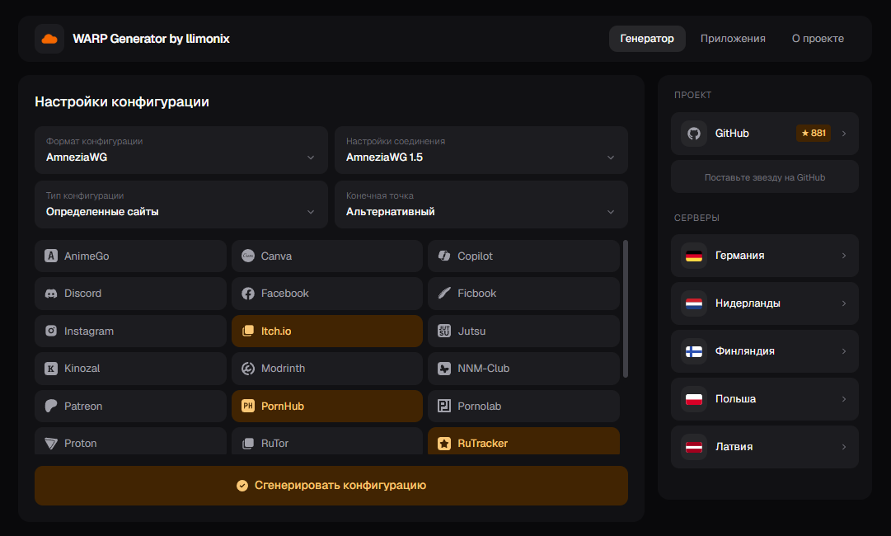

# مولد پیکربندی WARP

> **توجه:** پروژه تغییر مسیر داده است — اکنون این یک پنل اشتراک WARP روی
> Cloudflare Workers است (مولد به‌عنوان تب باقی مانده، اما از حساب ذخیره‌شده
> کار می‌کند). README اصلی — [انگلیسی](README.md)، راهنمای استقرار —
> [docs/ops/deploy.md](docs/ops/deploy.md).
> همهٔ متن زیر مولد **پشتیبانی‌نشدهٔ** قبلی را توصیف می‌کند.

[English](README.md) | [Русский](README_ru.md) | **فارسی**



مولد متن‌باز برای ساخت کانفیگ‌های Cloudflare WARP (WireGuard / AmneziaWG / Clash / Throne / Nekoray / Husi / Karing / WireSock).
این شاخهٔ **عمومی** است — بدون کپچا، بدون آنالیتیکس، بدون بلوک‌های تبلیغاتی. خودتان مستقرش کنید.

## 🚀 استقرار سریع

### Docker (پیشنهادی)

ایمیل را محلی بسازید (ایمیل آماده‌ای در رجیستری منتشر نمی‌شود):

```bash
docker build -t warp-generator .
docker run -d --name warp-generator \
  -p 3000:3000 \
  --restart unless-stopped \
  warp-generator
```

سپس http://localhost:3000 را باز کنید.

### Docker — ساخت محلی

```bash
docker build -t warp-generator-public .
docker run -d -p 3000:3000 --name warp-generator warp-generator-public
```

### docker-compose

```yaml
services:
  warp-generator:
    build: .
    container_name: warp-generator
    ports:
      - "3000:3000"
    restart: unless-stopped
```

### Vercel

[](https://vercel.com/new/clone?repository-url=https://github.com/QMahyar/warp-generator&repository-name=warp)
- یا از طریق [CLI](https://vercel.com/docs/cli): `vercel deploy`
- توسعهٔ محلی: `vercel dev`

### Netlify

[](https://app.netlify.com/start/deploy?repository=https://github.com/QMahyar/warp-generator&siteName=warp)
- یا از طریق [CLI](https://docs.netlify.com/cli/get-started/): `netlify deploy`
- توسعهٔ محلی: `netlify dev`

### Cloudflare Workers

[](https://deploy.workers.cloudflare.com/?url=https://github.com/QMahyar/warp-generator)
- یا از طریق [Wrangler](https://developers.cloudflare.com/workers/wrangler/): `wrangler deploy`
- توسعهٔ محلی: `wrangler dev`

### Cloudflare Pages

همان `wrangler.jsonc` با خروجی استاتیک برای Pages هم کار می‌کند.

```bash
CLOUDFLARE_WORKERS=1 npm run build
npx wrangler pages deploy out --project-name=warp-generator
```

یا ریپو را در داشبورد Cloudflare متصل کنید:
- دستور ساخت: `CLOUDFLARE_WORKERS=1 npm run build`
- پوشهٔ خروجی: `out`

## 🛠️ توسعهٔ محلی

```bash
npm install
npm run dev          # سرور توسعه روی پورت :3000
npm run build        # ساخت نسخهٔ تولید
npm run start        # اجرای نسخهٔ تولید
npm run lint
```

## ⚙️ گزینه‌های مولد و API

مولد در رابط کاربری و در `POST /api/generate` گزینه‌های یکسانی دارد:

| گزینه | رفتار و محدودیت‌ها |
|-------|---------------------|
| DNS | ارائه‌دهنده‌ها از `config/dns.ts` می‌آیند. ارائه‌دهنده‌های اجتماعی با `•` مشخص شده‌اند؛ انتخاب آن‌ها حالت **همهٔ سایت‌ها** را اجباری می‌کند و سرویس‌های انتخاب‌شده را پاک می‌کند چون از مسیریابی جزئی (split tunneling) پشتیبانی نمی‌کنند. شناسهٔ ناشناخته به‌صورت پیش‌فرض به DNS کلودفلر برمی‌گردد. |
| IPv6 | پیش‌فرض فعال است. غیرفعال کردن آن IPv6 را از آدرس اینترفیس، فهرست DNS و `AllowedIPs` پیش‌فرض همهٔ سایت‌ها حذف می‌کند. |
| Exclude LAN | فقط در حالت **همهٔ سایت‌ها** در دسترس است. مسیرهای پیش‌فرض را با بازه‌های آدرس عمومی جایگزین می‌کند تا بازه‌های خصوصی/رزروشده خارج از تونل بمانند. |
| PersistentKeepalive | پیش‌فرض غیرفعال است. اگر بدون مقدار فعال شود از `25` استفاده می‌شود؛ API اعداد صحیح از `1` تا `65535` را می‌پذیرد و مقادیر نامعتبر را نادیده می‌گیرد. در کانفیگ‌های WireGuard و WireSock قرار می‌گیرد. |
| Custom I1 | مقدار غیرخالی باید حداکثر ۲۵۳ کاراکتر و بدون فاصله باشد. AmneziaWG برای ساخت ماسک QUIC `I1` و WireSock به‌عنوان `Id` از آن استفاده می‌کند. ورودی خالی یا نامعتبر بی‌صدا به ماسک/دامنهٔ تصادفی پیش‌فرض برمی‌گردد. |

نمونهٔ درخواست به یک استقرار محلی:

```bash
curl -X POST http://localhost:3000/api/generate \
  -H 'Content-Type: application/json' \
  -d '{
    "selectedServices": [],
    "siteMode": "all",
    "deviceType": "awg15",
    "endpoint": "engage.cloudflareclient.com:4500",
    "configFormat": "wireguard",
    "dnsId": "cf",
    "ipv6": false,
    "excludeLan": true,
    "persistentKeepalive": 25,
    "customI1Domain": "google.com"
  }'
```

پاسخ موفق `success: true` و آبجکت `content` شامل `configBase64`، `qrCodeBase64`، `configFormat` و `fileName` دارد. `configBase64` شامل کانفیگ کدشده با Base64 و `qrCodeBase64` یک data URL تصویری است.

## ➕ افزودن سرویس جدید (PR خوش‌آمد)

حالت «سایت‌های مشخص» به کاربران اجازه می‌دهد سرویس‌هایی را برای عبور از WARP انتخاب کنند.
برای افزودن سرویس:

1. **فورک** کنید و یک شاخه بسازید (مثلاً `feat/service-newsite`).
2. **ایجاد** `config/services/<key-سرویس>.json`:
   ```json
   {
     "name": "نام نمایشی",
     "icon": "FaIconName",
     "iconLibrary": "fa",
     "type": "new",
     "ips": "1.2.3.0/24, 5.6.7.0/24, ..."
   }
   ```
   - `name` — نام سرویس قابل نمایش برای کاربر.
   - `icon` — نام آیکون از [react-icons](https://react-icons.github.io/react-icons/). وجود نام را در کتابخانهٔ انتخابی بررسی کنید.
   - `iconLibrary` — یکی از: `fa`، `fa6`، `si`، `bi`، `md`، `ri` و … (مطابق زیرپکیج react-icons).
   - `type` — اختیاری. برای نمایش نشان «جدید» مقدار `"new"` را بگذارید.
   - `ips` — بازه‌های CIDR با کاما جدا شده. از ابزار واقعی جستجوی ASN/IP استفاده کنید — whois کلودفلر، BGP.tools یا `whois -h whois.cymru.com " -v <ip>"`.
3. **ویرایش نکنید** `worker/api-handler.js` یا `functions/api/generate.js` را. یک GitHub Action (به نام `build-ip-ranges`) بلوک‌های `IP_RANGES` را در هر دو فایل پس از ادغام در `master` به‌طور خودکار بازسازی و سرویس جدید را به شاخهٔ `production` همگام می‌کند.
4. یک **PR** به `master` باز کنید.

### پیش‌نمایش محلی بازسازی

```bash
node scripts/build-ip-ranges.mjs
```

این اسکریپت روی `config/services/*.json` اجرا و بلوک `// IP_RANGES:BEGIN ... // IP_RANGES:END` را در هر دو فایل worker/functions بازنویسی می‌کند. اجرای مکرر بی‌خطر است — idempotent.

### افزودن ارائه‌دهندهٔ DNS

1. ارائه‌دهنده را با `id` یکتا، `label` نمایشی، آرایه‌های IPv4/IPv6 و `isCommunity` به `DNS_PROVIDERS` در `config/dns.ts` اضافه کنید.
2. اگر ارائه‌دهنده با مسیریابی سایت‌های مشخص کار نمی‌کند، `isCommunity: true` بگذارید. هم UI و هم API محدودیت همهٔ سایت‌ها را اعمال می‌کنند.
3. ورودی را در آرایه‌های توکار `DNS_PROVIDERS` در `worker/api-handler.js` و `functions/api/generate.js` هم بازتاب دهید. برخلاف IP ranges و ماسک‌های I1، ارائه‌دهنده‌های DNS فعلاً اسکریپت همگام‌سازی خودکار ندارند.
4. قبل از باز کردن PR، `npm run build` را اجرا کنید.

Docker و Vercel مستقیماً از `config/dns.ts` استفاده می‌کنند؛ Cloudflare Workers و Netlify هندلرهای توکار را اجرا می‌کنند. همگام نگه‌داشتن هر سه فهرست باعث می‌شود ارائه‌دهنده‌ای که UI نشان می‌دهد هنگام تولید کانفیگ به DNS کلودفلر برنگردد.

### نگهداری ماسک‌های پیش‌فرض I1

`lib/builders/shared.ts` منبع اصلی ماسک‌هاست که وقتی دامنهٔ I1 سفارشی داده نشود استفاده می‌شود:

1. فقط آرایهٔ `I1_MASKS` را بین نشانه‌های `// I1_MASKS:BEGIN` و `// I1_MASKS:END` ویرایش کنید.
2. `node scripts/build-i1-masks.mjs` را اجرا کنید.
3. تغییرات تولیدشده در `worker/api-handler.js` و `functions/api/generate.js` را همراه تغییر منبع commit کنید.

این اسکریپت نشانه‌ها و قالب ماسک را اعتبارسنجی می‌کند، هر دو هندلر توکار را به‌روزرسانی می‌کند و idempotent است. وورک‌فلو `build-i1-masks` هم هنگام تغییر منبع/اسکریپت/وورک‌فلو در `master` اجرا و هندلرهای production را بازسازی می‌کند. بلوک‌های I1 تولیدشده را دستی ویرایش نکنید.

## 📁 ساختار پروژه

```
├── app/
│   ├── layout.tsx                 چیدمان ریشه (فونت Geist، متا)
│   ├── page.tsx                   کامپوننت سرور — بارگذاری سرویس‌ها
│   ├── not-found.tsx              صفحهٔ 404
│   └── api/generate/route.ts      اندپوینت POST (تولید کانفیگ)
│
├── components/
│   ├── home-client.tsx            پوستهٔ کلاینت (تب‌ها، وضعیت)
│   ├── layout/
│   │   ├── topbar.tsx             لوگو + ناوبری تب
│   │   ├── sidebar.tsx            لینک گیت‌هاب + فهرست سرور (چسبان)
│   │   └── footer.tsx
│   ├── generator/
│   │   ├── config-selectors.tsx   دراپ‌داون‌های سفارشی (فرمت، دستگاه و …)
│   │   ├── advanced-settings.tsx  کنترل‌های IPv6، keepalive و I1 سفارشی
│   │   ├── service-picker.tsx     شبکهٔ انتخاب سرویس
│   │   ├── result-panel.tsx       بلوک نتیجهٔ دانلود / کپی / QR
│   │   ├── formats-tab.tsx        فهرست فرمت‌های پشتیبانی‌شده
│   │   └── about-tab.tsx          درباره + کلاینت‌های سازگار
│   └── icons/                     حل‌کنندهٔ آیکون + آیکون‌های پرچم
│
├── config/
│   ├── services/                  فایل‌های JSON — یکی برای هر سرویس (بازه‌های IP)
│   ├── services-loader.ts         بارگذاری خودکار همهٔ JSONها در شروع
│   ├── dns.ts                     ارائه‌دهنده‌های DNS و محدودیت‌های split tunnel
│   ├── endpoints.ts               اندپوینت‌های Cloudflare WARP
│   └── formats.ts                 تعریف‌های فرمت کانفیگ
│
├── lib/
│   ├── builders/                  یک فایل برای هر فرمت کانفیگ
│   │   ├── wireguard.ts
│   │   ├── throne.ts
│   │   ├── clash.ts
│   │   ├── nekoray.ts
│   │   ├── husi.ts
│   │   ├── karing.ts
│   │   ├── wiresock.ts
│   │   ├── shared.ts              پروفایل‌های دستگاه و ماسک‌های I1 پیش‌فرض
│   │   └── index.ts               توزیع‌کننده — buildConfig(format, params)
│   ├── warp-service.ts            هماهنگ‌کننده (کلیدها → CF → ساخت → QR)
│   ├── quic.ts                    تولید ماسک QUIC I1 سفارشی
│   ├── cloudflare-client.ts       ثبت در API کلودفلر WARP
│   ├── crypto.ts                  تولید کلید (tweetnacl)
│   ├── qr-generator.ts            QR محلی + جایگزین SVG
│   └── ip-ranges.ts               بازصادرات از services-loader
│
├── hooks/
│   ├── use-generator.ts           منطق تولید سمت کلاینت
│   └── use-mobile.ts              هوک نقطهٔ شکست واکنش‌گرا
│
├── scripts/
│   ├── build-ip-ranges.mjs        بازسازی IP_RANGES در worker + functions
│   └── build-i1-masks.mjs         بازسازی I1_MASKS در worker + functions
│
├── worker/                        رانتایم Cloudflare Workers
├── functions/                     رانتایم Netlify Functions
├── types/                         تعریف‌های تایپ TypeScript
├── styles/globals.css             توکن‌های طراحی + تم تیره
├── .github/workflows/             CI: ساخت Docker، بازسازی IP_RANGES و I1_MASKS
├── Dockerfile                     ساخت مستقل production (عمومی)
├── next.config.mjs
└── package.json
```

## 🔧 پیکربندی

برای نسخهٔ عمومی هیچ متغیر محیطی لازم نیست. مولد به‌صورت ناشناس روی API عمومی ثبت‌نام Cloudflare WARP کار می‌کند.

### حالت‌های ساخت

`next.config.mjs` بر اساس محیط `output` را تغییر می‌دهد:

| متغیر محیطی | خروجی | استفاده |
|-------------------------------|------------------|--------------------------|
| `DOCKER_BUILD=1` | `standalone` | Docker / Dokploy |
| `CLOUDFLARE_WORKERS` / `CF_PAGES` | `export` | CF Workers / CF Pages |
| _هیچ‌کدام_ | پیش‌فرض | Vercel / Netlify |

## 🌐 پلتفرم‌های پشتیبانی‌شده

| پلتفرم | پشتیبانی | توضیحات |
|-----------------------|----------|------------------------------------------|
| Docker (self-host) | ✅ کامل | سرور مستقل Next.js |
| Vercel | ✅ کامل | رانتایم پیش‌فرض |
| Netlify | ✅ کامل | Edge functions |
| Cloudflare Workers | ✅ کامل | خروجی استاتیک + worker |
| Cloudflare Pages | ✅ کامل | خروجی استاتیک |

## 📄 مجوز

مجوز MIT — [LICENCE](LICENCE) را ببینید

## 🤝 مشارکت

1. ریپازیتوری را فورک کنید
2. یک شاخهٔ ویژگی بسازید
3. تغییرات خود را اعمال کنید
4. Pull Request باز کنید